# 🔄 Development Workflow & Quality Assurance

This document outlines the development workflow, linting, formatting, and quality assurance processes for this project.

---

## 📋 Table of Contents

1. [Pre-commit Hooks](#pre-commit-hooks)
2. [Commit Message Format](#commit-message-format)
3. [Pre-push Checks](#pre-push-checks)
4. [Available Scripts](#available-scripts)
5. [CI/CD Pipeline](#cicd-pipeline)
6. [IDE Setup](#ide-setup)
7. [Troubleshooting](#troubleshooting)

---

## 🎣 Pre-commit Hooks

Pre-commit hooks automatically run before each commit to ensure code quality.

### What Runs on Pre-commit

**Automated by `lint-staged`:**

| File Type                  | Actions                             |
| -------------------------- | ----------------------------------- |
| `*.php`                    | Laravel Pint (automatic formatting) |
| `*.scss`                   | Prettier → Stylelint --fix          |
| `*.{ts,tsx,js,jsx}`        | Prettier → ESLint --fix             |
| `*.{css,json,md,html,vue}` | Prettier                            |

### How It Works

```bash
# When you commit:
git add .
git commit -m "feat: add new feature"

# Automatically runs:
# 1. Checks staged files
# 2. Runs formatters and linters
# 3. Auto-fixes issues where possible
# 4. Stages the fixed files
# 5. Continues with commit
```

---

## 💬 Commit Message Format

We follow **Conventional Commits** specification.

### Format

```
<type>(<scope>): <subject>

[optional body]

[optional footer]
```

### Types

| Type       | Description                  | Example                                  |
| ---------- | ---------------------------- | ---------------------------------------- |
| `feat`     | New feature                  | `feat(auth): add OAuth login`            |
| `fix`      | Bug fix                      | `fix(page-builder): canvas height issue` |
| `docs`     | Documentation                | `docs: update installation guide`        |
| `style`    | Code style (no logic change) | `style(header): improve spacing`         |
| `refactor` | Code restructuring           | `refactor(api): simplify user service`   |
| `perf`     | Performance improvement      | `perf(db): optimize query`               |
| `test`     | Add/update tests             | `test(auth): add login tests`            |
| `build`    | Build system/dependencies    | `build: upgrade Laravel to 12`           |
| `ci`       | CI/CD changes                | `ci: add deployment workflow`            |
| `chore`    | Maintenance tasks            | `chore: update dependencies`             |
| `revert`   | Revert previous commit       | `revert: undo feature X`                 |

### Examples

```bash
# Good ✅
git commit -m "feat(page-builder): make canvas responsive to viewport height"
git commit -m "fix(auth): resolve session timeout issue"
git commit -m "docs: add API documentation"

# Bad ❌
git commit -m "fixed stuff"
git commit -m "WIP"
git commit -m "updates"
```

### Scope (Optional)

Scope indicates the area of the codebase:

- `auth` - Authentication
- `page-builder` - Page builder
- `api` - API endpoints
- `admin` - Admin panel
- `theme` - Theming system
- `db` - Database
- etc.

---

## 🚀 Pre-push Checks

Before pushing to remote, additional checks run to ensure code quality.

### What Runs on Pre-push

1. **TypeScript Type Checking** - All TS files checked for type errors
2. **ESLint** - JavaScript/TypeScript linting
3. **Stylelint** - SCSS linting

### Bypassing (Not Recommended)

```bash
# Only in emergencies!
git push --no-verify
```

---

## 📜 Available Scripts

### Frontend Scripts

```bash
# Development
npm run dev                    # Start Vite dev server
npm run dev:themes             # Watch theme files
npm run dev:page-builder       # Page builder dev server
npm run dev:all                # Run all dev servers

# Build
npm run build                  # Build all assets
npm run build:themes           # Build themes only
npm run build:page-builder     # Build page builder only
npm run build:all              # Build everything

# Type Checking
npm run type-check             # Check main TypeScript
npm run type-check:themes      # Check theme TypeScript
npm run type-check:pagebuilder # Check page builder TypeScript
npm run type-check:all         # Check all TypeScript

# Linting
npm run lint                   # ESLint
npm run lint:fix               # ESLint with auto-fix
npm run lint:scss              # Stylelint
npm run lint:scss:fix          # Stylelint with auto-fix
npm run lint:all               # Run all linters
npm run lint:all:fix           # Run all linters with auto-fix

# Formatting
npm run format                 # Format all files
npm run format:check           # Check formatting
npm run format:scss            # Format SCSS only
npm run format:all             # Format and lint

# Testing
npm run test                   # Run all tests
npm run test:js                # Frontend tests
npm run test:quick             # Quick validation

# Validation
npm run validate               # Full validation (format check + lint + type check)
```

### Backend Scripts

```bash
# Linting & Formatting
./vendor/bin/pint              # Format all PHP files
./vendor/bin/pint --test       # Check without formatting
./vendor/bin/pint path/to/file.php  # Format specific file

# Testing
./vendor/bin/phpunit           # Run all tests
./vendor/bin/phpunit --filter=TestName  # Run specific test
./vendor/bin/phpunit tests/Feature  # Run feature tests only

# IDE Helpers
composer run dev-ide-helper   # Generate IDE helper files

# Development
composer run dev              # Start all services (server, queue, logs, vite)
```

---

## 🔄 CI/CD Pipeline

GitHub Actions automatically run on push and pull requests.

### Workflow Jobs

**Frontend Job:**

- ✅ Code formatting check
- ✅ ESLint
- ✅ Stylelint
- ✅ TypeScript type checking
- ✅ Build assets

**Backend Job (PHP 8.2 & 8.3):**

- ✅ Code style check (Pint)
- ✅ Run migrations
- ✅ PHPUnit tests

### Workflow Triggers

- **Push** to `master`, `main`, or `develop` branches
- **Pull Requests** to `master`, `main`, or `develop` branches

### Viewing Results

1. Go to **Actions** tab in GitHub
2. Click on the workflow run
3. View detailed logs for each job

---

## 🛠️ IDE Setup

### VS Code

**Recommended Extensions:**

```json
{
    "recommendations": [
        "dbaeumer.vscode-eslint",
        "esbenp.prettier-vscode",
        "stylelint.vscode-stylelint",
        "bmewburn.vscode-intelephense-client",
        "bradlc.vscode-tailwindcss"
    ]
}
```

**Settings (`.vscode/settings.json`):**

```json
{
    "editor.formatOnSave": true,
    "editor.defaultFormatter": "esbenp.prettier-vscode",
    "editor.codeActionsOnSave": {
        "source.fixAll.eslint": true,
        "source.fixAll.stylelint": true
    },
    "[php]": {
        "editor.defaultFormatter": "bmewburn.vscode-intelephense-client"
    },
    "files.associations": {
        "*.blade.php": "blade"
    }
}
```

### PhpStorm

1. **Enable Prettier:**
    - Settings → Languages & Frameworks → JavaScript → Prettier
    - Check "On 'Reformat Code' action"
    - Check "On save"

2. **Enable ESLint:**
    - Settings → Languages & Frameworks → JavaScript → Code Quality Tools → ESLint
    - Select "Automatic ESLint configuration"
    - Check "Run eslint --fix on save"

3. **Enable PHP CS Fixer:**
    - Settings → PHP → Quality Tools → PHP CS Fixer
    - Configure path to `./vendor/bin/pint`

---

## 🔧 Troubleshooting

### Pre-commit Hook Not Running

```bash
# Reinstall Husky
npm run prepare

# Make hooks executable
chmod +x .husky/pre-commit
chmod +x .husky/commit-msg
chmod +x .husky/pre-push
```

### Lint-staged Fails

```bash
# Check specific linter
npm run lint              # Check ESLint
npm run lint:scss         # Check Stylelint
./vendor/bin/pint --test  # Check PHP

# Fix automatically
npm run lint:fix          # Fix ESLint issues
npm run lint:scss:fix     # Fix Stylelint issues
./vendor/bin/pint         # Fix PHP issues
```

### Type Check Errors

```bash
# Run type check to see errors
npm run type-check:all

# Check specific project
npm run type-check              # Main project
npm run type-check:themes       # Themes
npm run type-check:pagebuilder  # Page builder
```

### Commit Message Rejected

```bash
# Bad format - will be rejected
git commit -m "fixed bug"

# Good format - will be accepted
git commit -m "fix(auth): resolve login timeout issue"
```

### Bypassing Hooks (Emergency Only)

```bash
# Skip pre-commit and commit-msg hooks
git commit --no-verify -m "emergency fix"

# Skip pre-push hooks
git push --no-verify
```

**⚠️ Warning:** Only bypass hooks when absolutely necessary!

---

## 📊 Workflow Summary

```mermaid
graph TD
    A[Write Code] --> B[git add .]
    B --> C[git commit]
    C --> D{Pre-commit Hook}
    D -->|Format & Lint| E{Commit Message}
    E -->|Valid Format| F[Commit Created]
    E -->|Invalid| G[❌ Rejected]
    F --> H[git push]
    H --> I{Pre-push Hook}
    I -->|Type Check & Lint| J[Push to Remote]
    I -->|Fails| K[❌ Push Rejected]
    J --> L{GitHub Actions}
    L --> M[Frontend Tests]
    L --> N[Backend Tests]
    M --> O{All Pass?}
    N --> O
    O -->|Yes| P[✅ Merge Ready]
    O -->|No| Q[❌ Fix Required]
```



---

## 🎯 Best Practices

1. **Run validation before committing:**

    ```bash
    npm run validate
    ```

2. **Write meaningful commit messages:**
    - Be specific about what changed
    - Use the appropriate type
    - Include scope when relevant

3. **Fix linting issues immediately:**
    - Don't bypass hooks unless emergency
    - Use auto-fix features
    - Check IDE for real-time feedback

4. **Keep dependencies updated:**

    ```bash
    npm outdated              # Check npm packages
    composer outdated         # Check composer packages
    ```

5. **Run tests before pushing:**
    ```bash
    npm run test:js
    ./vendor/bin/phpunit
    ```

---

## 📚 Additional Resources

- [Conventional Commits](https://www.conventionalcommits.org/)
- [ESLint Rules](https://eslint.org/docs/rules/)
- [Stylelint Rules](https://stylelint.io/user-guide/rules/)
- [Laravel Pint](https://laravel.com/docs/pint)
- [Husky Documentation](https://typicode.github.io/husky/)
- [lint-staged](https://github.com/okonet/lint-staged)

---

**Questions or issues?** Check the troubleshooting section or reach out to the team!
